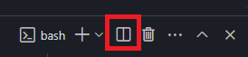

<p>

</p>

# Projeto PetShop 🦴

O projeto Pet Dev é para fixar e treinar contéudos de Context API.

Foi um desafio do curso FullStack pro, onde não tem correção, apenas fazemos o desafio e cumprimos os requisitos passados como:

- Consumir a Fake API
- Utilizar Context API
- Ter uma tela para cada produto com React Router
- O carrinho ser dinâmico para cada item adicionado ou removido
- Ter uma página de sucesso de pagamento
- Ter página de erros, como página não encontrada ou produto não encontrado

# Como usar 📂
Primeiramente abrimos o terminal do vs code com <strong>CRTL "</strong>


Então selecionamos para abrir dois terminais no canto superior direito

<p>
  
</p>

No primeiro Terminal rodamos o comando 
````
  npx json-server db.json
````


Aqui iremos rodar a biblioteca JSON Server para fazer que com nossa API FAKE rode como uma API real


rodamos o comando no terminal, se deu tudo certo irá aparecer esta janela.

Agora no segundo terminal irá rodar o comando 

````js
  npm run dev
````


Irá aparecer esta tela! È só clicar no link que o Vite nos apresentou e Rodar o projeto


# Tecnologias 🚀
- React
- TypeScript
- TailwindCSS
- Axios
- Context API
- Vite
- React Router
- React Icons
- Json Server
- Framer Motion (Animações)
- React Hot Toas (Notificações)
